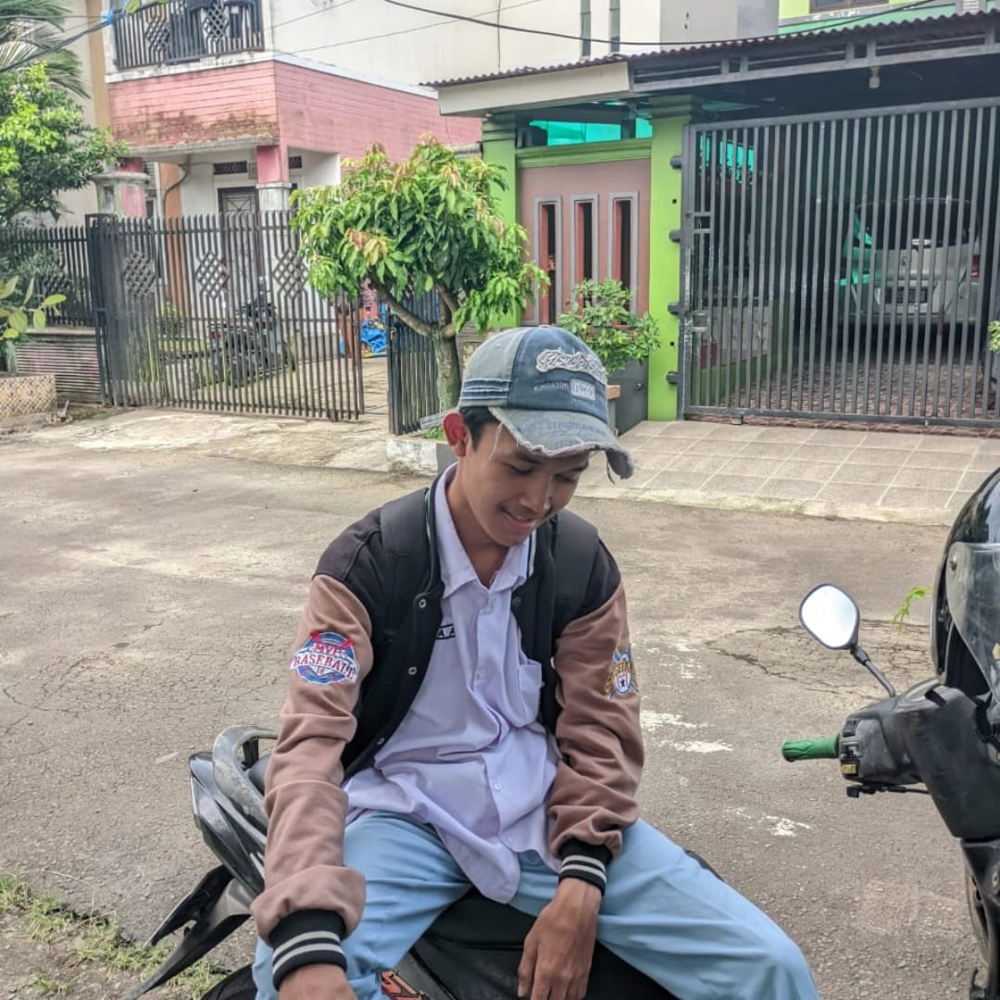

<h2 align="left">Hi 👋! Nama Saya Resya Anggara || Uhuyy 🔥</h2>

###

 
 
 
<!-- 

  

 -->

###

###

  
  

###

  
  
  
  
  
  
  
  
  
  
  
  
  
  
  
  
  

###

  
  
  
  

###
<!--
 

  

 

-->
###

<picture>
  <source media="(prefers-color-scheme: dark)" srcset="https://raw.githubusercontent.com/Resyourbae/Resyourbae/output/pacman-contribution-graph-dark.svg">
  <source media="(prefers-color-scheme: light)" srcset="https://raw.githubusercontent.com/Resyourbae/Resyourbae/output/pacman-contribution-graph.svg">
  
</picture>

###

###
# 💫 About Me:
im currently studiying

## 🏆 GitHub Trophies

### 🔝 Top Contributed Repo

---

<!-- Proudly created with GPRM ( https://gprm.itsvg.in ) -->
 
